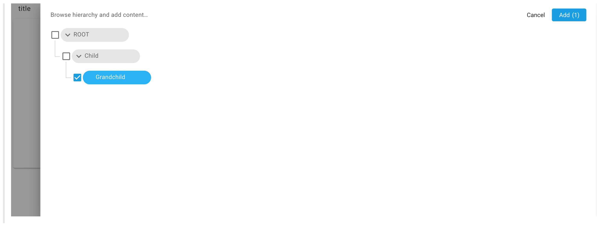
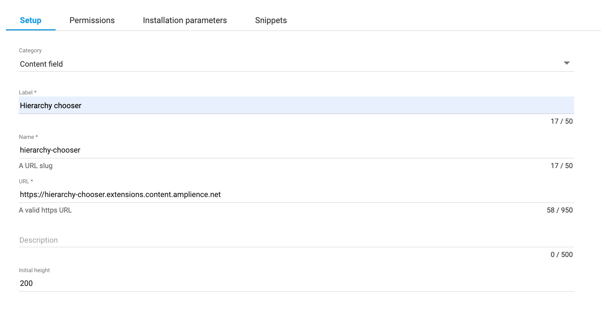
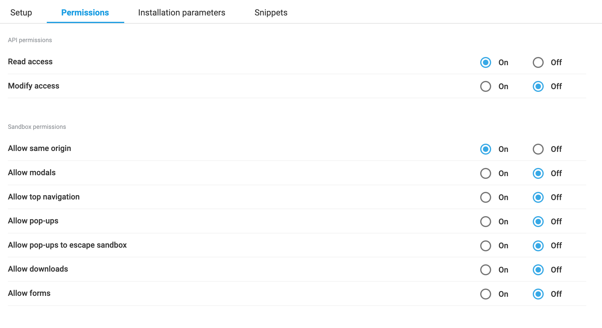

[](https://amplience.com/dynamic-content)



# dc-extension-hierarchy-chooser

> Hierarchy chooser field for use in [Amplience Dynamic Content](https://amplience.com/dynamic-content)

This extension is designed to replace content link and content reference fields to allow items to be selected from a hierarchy tree.

## How to install

This extension needs to be [registered](https://amplience.com/docs/development/registeringextensions.html) on a hub within the Dynamic Content application (Developer -> Extensions).



- Category: Content Field
- Label: A suitable label so the extension can be easily identified e.g. 'Hierarchy Chooser'
- Name: A unique name for the extension e.g. 'hierarchy-chooser'
- URL: The URL that the extension is hosted on (https://hierarchy-chooser.extensions.content.amplience.net)
- Description: An optional description to help identify the extension
- Initial height: The height in pixels that you want the extension to take up within the content form e.g. 200

**Note:** You can use our deployed version of this extension - https://hierarchy-chooser.extensions.content.amplience.net

_As this is an open source project you're welcome to host your own "fork" of this project. You can use any standard static hosting service (Netlify, Amplify, Vercel, etc.) if you wish._

### Permissions



Api permissions:

- Read access

Sandbox permissions:

- Allow same origin

### Assign the extension to a schema

To use the hierarchy chooser extension you need to add a content link or content reference field to your content type schema. This extension also works with lists of content links and references.

```json
{
  "type": "array",
  "ui:extension": {
    "name": "<extension name>",
    "params": {
      "nodeId": "<root node ID>"
    }
  },
  "items": {
    "allOf": [
      {
        "$ref": "http://bigcontent.io/cms/schema/v1/core#/definitions/content-link"
      },
      {
        "properties": {
          "contentType": {
            "enum": ["<hierarchcal content type>"]
          }
        }
      }
    ]
  }
}
```

## Installation parameters

| Parameter | Default   | Notes                                                  | Required |
| --------- | --------- | ------------------------------------------------------ | -------- |
| nodeId    | undefined | The ID of the node to use as the root node of the tree | true     |
| type      | 'large'   | Display settings options: large, small, chip           | false    |

```json
{
  "ui:extension": {
    "params": {
      "nodeId": "123456",
      "type": "chip"
    }
  },
  "allOf": [
    {
      "$ref": "http://bigcontent.io/cms/schema/v1/core#/definitions/content-reference"
    },
    {
      "properties": {
        "contentType": {
          "enum": ["<hierarchcal content type>"]
        }
      }
    }
  ]
}
```

### Sample schema

```json
{
  "$schema": "http://json-schema.org/draft-07/schema#",
  "$id": "<schema name>",
  "title": "Title",
  "description": "Description",
  "allOf": [
    {
      "$ref": "http://bigcontent.io/cms/schema/v1/core#/definitions/content"
    }
  ],
  "type": "object",
  "properties": {
    "treeNodes": {
      "title": "title",
      "type": "array",
      "minItems": 2,
      "maxItems": 5,
      "ui:extension": {
        "name": "<extension name>",
        "params": {
          "nodeId": "<root node ID>",
          "type": "chip"
        }
      },
      "items": {
        "allOf": [
          {
            "$ref": "http://bigcontent.io/cms/schema/v1/core#/definitions/content-link"
          },
          {
            "properties": {
              "contentType": {
                "enum": ["https://example.schema.com"]
              }
            }
          }
        ]
      }
    }
  },
  "propertyOrder": []
}
```

## How to run locally

```bash
  npm i
  npm run serve
```

Head to http://localhost:8080 for the locally running extension

## Building the extension

```bash
$ npm run build
```
